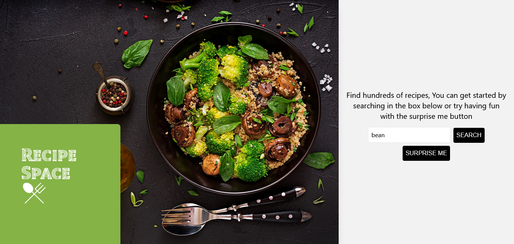

# Recipe Space

Recipe Space is a web application that allows you to search for particular recipes and also discover random recipes with just a click of a button. The application is built using React, TypeScript, Tailwind CSS, and integrates with an external recipe API.

## Table of Contents

- [Introduction](#introduction)
- [Features](#features)
- [Technologies Used](#technologies-used)
- [Getting Started](#getting-started)
- [Installation](#installation)
- [Usage](#usage)
- [API Integration](#api-integration)
- [Contributing](#contributing)
- [License](#license)
- [Live Preview](#live-preview)

## Introduction

Recipe Space is a platform designed for food enthusiasts and home cooks to easily find and discover new recipes. With its intuitive interface and powerful search capabilities, users can quickly access a vast collection of recipes from various cuisines. Moreover, the "Surprise Me" feature adds an element of excitement by suggesting a random recipe for those who enjoy trying out new dishes.

## Features

- Search for recipes by name, ingredients, or cuisine.
- Discover random recipes with the "Surprise Me" button.
<!-- - View detailed recipe information, including ingredients and instructions.
- Save favorite recipes to a personal collection. -->
- Responsive design for seamless browsing across devices.

## Technologies Used

- React
- TypeScript
- Tailwind CSS
- Recipe API (e.g.,TheMealdb, Spoonacular API, Yummly API, etc.)

## Getting Started

To get started with Recipe Space, follow these steps:

## Installation

1. Clone the repository: `git clone https://github.com/cyber-jev/recipe-space.git`
2. Navigate to the project directory: `cd recipe-space`
3. Install dependencies: `npm install`

## Usage

1. Start the development server: `npm start`
2. Open your web browser and visit: `http://localhost:3000`
3. You should now see the Recipe Space web application up and running.

## API Integration

Recipe Space integrates with an external Recipe API to fetch recipe data. To use the application, you may need to obtain an API key from the chosen Recipe API provider and add it to the application's configuration.

Please refer to the documentation of the specific Recipe API provider to understand the endpoints and data format required for integration.

## Contributing

We welcome contributions to improve Recipe Space and make it better. If you find any bugs or have ideas for new features, feel free to open an issue or submit a pull request.

1. Fork the repository on GitHub.
2. Create a new branch with a descriptive name: `git checkout -b feature/my-feature` or `git checkout -b bugfix/issue-fix`.
3. Make your changes and commit them: `git commit -m "Add feature"`.
4. Push your changes to your fork: `git push origin feature/my-feature`.
5. Open a pull request on the main repository.

## License

Recipe Space is open-source software licensed under the [MIT License](LICENSE). Feel free to use, modify, and distribute the code as per the terms of the license.

## Live Preview

Check out the live preview of Recipe Space [here](https://recipespace.vercel.app/).
